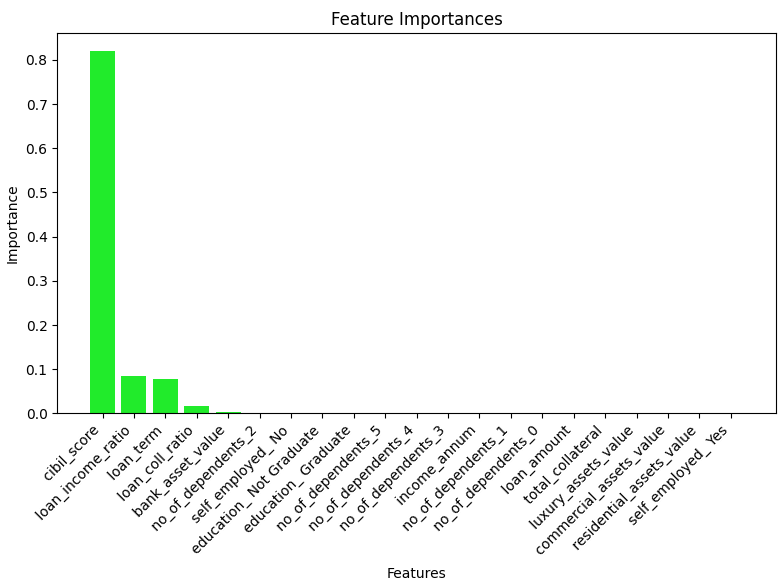
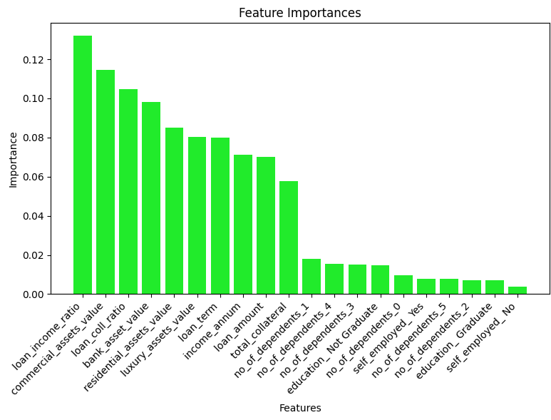

<h1 style="text-align:center;">Loan Approval Project</h1>

<p style="text-align:center;">By Blake Dennett<p>


<h1>Table of Contents</h1>

* <a href="#project-summary">Project Summary</a>

* <a href="#visualizations">Power Bi Visuals</a>

* <a href="#data-analysis">Data Analysis/Feature Engineering</a>

* <a href="#machine-learning">Machine Learning</a>

    * <a href="#decision-tree">Decision Tree</a>
    * <a href="#neural-network">Neural Network</a>

* <a href="#acknowledgments">Acknowledgements</a>


## Project Summary

* #### Visuals

<h4>My project is broken up into three parts. The first was visualizations which took about one week (18 hours). I wanted exposure to Power Bi so I made 24 relevant graphs. (Only 21 were put into this readme file.) I felt that these graphs gave huge insight into the dataset and helped me in my analysis section of my project.</h4>

* #### Data Analysis Summary

<h4>The second part of my project was data analysis. This also took 1 week (18 hours). This phase was a little tough because there was very little insight as to specifics on what the data meant. My graphs really helped me get some ideas though. This was roughly one or two days of data cleaning and the rest was looking into questions I had. Unfortunately, there weren't any dates to work with which could have led to much more work in this area.</h4>

* #### Decision Tree Summary 

<h4>The third part of my project was machine learning. This took two weeks (36 hours). I used five different types of decision trees and had the hyperparameters randomly selected in an infinite while loop with each type running in parrellel. The results were written to a file when a new best score was found. This took a bit of manual changes and a lot of cpu time but it yeilded great results.</h4>

* #### Neural Network Summary

<h4>The fourth part of my project was a neural network which took roughly another two weeks. I used Tensorflow to build the network and used a Keras tuner called Hyperband that selected most of the hyperparameters and logged them for me. This was a slick tool I found and I was happy to get it working. Additionally, I was able to implement a learning rate scheduler. I was a bit disappointed about the results, but I think that it primarily underperformed because of such little data, not because of the model itself.</h4>


<a href="https://www.kaggle.com/datasets/architsharma01/loan-approval-prediction-dataset">Kaggle Dataset<a>


# Visualizations


## Loan Status Comparisons 


<h4>The credit score has a huge average difference for rejected and approved loans while education, self-employment, and the term of the loan don't seem to be impactful.</h4>

<br><br>

## Benford's Law

<h4>Benford's law deals with the first digit of each number in an exponentially increasing set of values. It states that lower numbers should occur more frequently as seen in the graph below. This law is used for fraud detection.</h4>


### Interpretation


<h4>Here are the actual results of a few of the features from this dataset. In comparison to the example above, it appears that the income column is far from the correct distribution while the others are relatively close. The smallest income in the whole set is $200,000 so I hardly think that this represents average individuals with regards to finance.</h4>

<h4>The data, however, only has 4,196 rows and therefore isn't big enough to completely make any final judgement. I'm not positive as the exact reason that the income is so far off other than the data not being selected completely randomly.</h4>

<br><br>

### Feature Correlation


<h4>Bank, commercial, luxury assets have strong correlation as well as income and loan amount.</h4>
<h4>Loan term, Cibil score, and number of dependents, however, do not correlate much with any other feature.</h4>

<br><br>

## Feature Distributions 


<h4>I'm surprised to see hardly any sure normal distributions. Unfortunately, this may be because the dataset is so small. Additionally, because the annual income is not normally distributed (as it should be) and did not even come close to passing Benford's Law, I wonder how this dataset was selected. One guess I have was that somehow it was chosen based on income. The loan success rate in this data is about 62.22%.</h4>

<br><br>


<h4>Clearly, the bank sets a fairly hard limit with anyone below a 550 credit score, with the occasional exception.</h4>
<h4>In choosing this data, it seems as though it was first filtered due to its clear lack of outliers.</h4><h4>Because the graph is so dense, I used DAX to create a new column to limit the number of points by half.</h4>

```
    filtered_cibil = 
    SWITCH(
        TRUE(),
        MOD(loan_approval_dataset[loan_id], 2) = 0, BLANK(),
        loan_approval_dataset[ cibil_score]
    )
```  

<br><br>

### Assests by Loan Term


<h4>Surprisingly, the luxury assets on average are by far the most expensive, followed by residential.</h4>
<h4>Additionally, it appears that the asset values don't change too much by the loan term.</h4>


<br><br>

### Loan Amount Ratios with Income And Collateral


<h4>This graph compares two features I made which each compare the collateral or income to the loan amount. Surprisingly, as the loans become bigger proportionally to the income, the rejections seem to actually decrease. Additionally, the collateral doesn't seem to have too much impact. The only exception being that any case where the loan is the same or more than the total collateral are all rejected.</h4>

<h4>I did some further analysis on the bottom-left section of this graph as well. The few rejected points in that cluster are surprising because they have both huge collateral and income in proportion to the loan amount. I looked into one and the only poor indicator was the credit score was only 472. Therefore, either the credit score mattered enough to the loan officer to reject this loan or there is missing information that may be intrinsic or something to do with additional debt that the individual may have had.</h4>

<br><br>


# Data Analysis

* <a href="./analysis.ipynb">Analysis Code</a>

## Data Cleaning

<h4>The dataset was very clean. This was unfortunate because I wanted some extra practice working with more difficult data.</h4>

### Missing Values

<h4>There were no missing values in the data, nor were there any incomplete entries in any of the categorical data.</h4>

### Outliers

<h4>I looked into the numerical features for any values high or lower than three standard deviations from the average. There were 33 total that were above the upper limit and none below the lower. The values were split among the residential and commercial assets. I decided to take the values down to simply equal the upper limit.</h4>

### Negative Values

<h4>There were 28 negative values in the data. All were from the residential assets column and were the exact same value. I thought this was odd and found that most of the instances had different values in the rest of their respective rows. I'm not positive what the cause is. I decided to change them all to zero.</h4>

## Analysis & Feature Engineering

### Total Collateral & Loan Ratio

<h4>I created a new feature that was the sum of all the four assets. I then created a new column that was the ratio of the loan amount to the total collateral. I thought this would be a good indicator of the risk of the loan and will help me with both the machine learning later and further analysis.</h4>

### Loan Amount and Income Ratio

<h4>I made a new column by taking the loan amount and dividing it by the annual income. The average is about 2.88. I thought this would be a valuable new feature because at a glance I could see if the income was too small to be able to support the debt in the future.</h4>

### Credit Score Odd Values

<h4>Looking at the credit score scatter plot found above, I decided to look into the few values that were above a 550 credit score but were still rejected. There were only 13 in total. The primary insight I found was that the collateral was low. The total collateral to loan ratio average for the 13 was 1.08 (meaning the collateral was the same or more than the loan) while the average ratio for the entire dataset was 0.489 (the collateral being about double the loan).</h4>

<h4>Additionally, I took a look at the proportion of the loan to the income. The mean for the entire dataset is 2.88 (the loan being almost three times the annual income). On the other hand, the mean for the 13 rejected loans was 3.66. This seems to be another strong indicator of whether a loan is approved or rejected because a rule of thumb is that the annual income should be roughly a third of the loan.</h4>

### Approvals Below a 550 Cibil Score

<h4>Again, looking at the Cibil Score scatter plot found above in the visualizations section, I found a few anomalies. There is a clear cut off at the 550 mark, but I wanted to dive into the approved loans that did fall short. Overall, only 10.36% of the rows in the data that were below a 550 Credit Score were approved for the loan that was asked. I made a hypothesis by assuming that the rest of the major indicators of the records were much better than the average. My hypothesis was wrong. The average income of these points is lower than the total average while the loan amount is higher. Additionally, both the loan collateral ratio and the loan income ratio are worse in these instances. I am surprised that these specific cases were approved over others. The loan term is about 28% of the total average. This could be a reason that the banks approved these loans because the principal could be returned sooner. However, a lower term also means a higher payment.</h4>

<h4>My conclusion equates to two items. The first was found through looking at the specific types of collateral. Specifically comparing the loans under 550 that were and were not approved, the loans that were successful had significantly more collateral in the residential and commercial assets than the luxury and bank assets. This gave a crucial insight because the banks must see these two types as a higher priority. The second conclusion I have is that there is missing data that is not accounted for like time with the bank, age, purpose of the loan, and any sort of date.</h4>

### Approved Vs Rejected

|                     |Approved  |Rejected  |Difference|
|---------------------|----------|----------|----------|
|Credit Score         |711       |429       |282       |
|Income               |5,000,000 |5,100,000 |-100,000  |
|Loan Amount          |14,600,000|14,500,000|100,000   |
|Total Colateral      |31,000,000|31,900,000|-900,000  |
|Loan Collateral Ratio|0.473     |0.457     |0.016     |
|Income to Loan Ratio |3.05      |2.88      |0.175     |
|Dependents           |2.5       |3         |-0.5      |

<h4>This table is the median of each respective row and column, which is why the values are so exact. (The length of the dataset is an odd number, therefore giving a middle number)</h4>

### Interpretation

<h4>In reality, the biggest finding here is that the credit score seems to be a huge indicator for whether a loan is approved or not. The rest of these values are hardly different and therefore do not seem to have much impact. My assumption is that the Cibil score is the first value evaluated and then further analysis is done from there.</h4>

### Correlation and P-Values

<h4>Because the Cibil score seems to be such a primary tool to determine whether a loan is approved, I decided to compare every other numerical feature to it. I used a method called pearsonr from the scipy.stats package. This gave me the correlation and p-value between each feature and the Cibil score. Ultimately, there was very little correlation and each p-value was well above 0.05.</h4>

#### Comparison to Credit Score

|                     |Correlation|P-value|
|---------------------|-----------|-------|
|Number of Dependents |-0.01      |0.51|
|Annual Income        |-0.023     |0.13|
|Loan amount          |-0.017     |0.27|
|Loan term            |0.008      |0.61|
|Residential Assets   |-0.024     |0.11|
|Commercial Assets    |0.003      |0.87|
|Luxury Asset Value   |-0.029     |0.06|
|Bank Asset Value     |-0.015     |0.31|
|Loan Collateral Ratio|0.001      |0.93|
|Loan Income Ratio    |0.003      |0.85|


### Missing Asset Analysis

#### Residential Assets

<h4>I took a look at the cases where there was no residential asset value. There were 89 rows 33 were rejected, and 56 were approved. This is about the same in proportion to the whole dataset. Even though the avg loan collateral ratio was about 24% worse, the average credit score was almost the same.</h4>

#### Commercial Assets

<h4>There were 124 rows of where there were no commercial assets, 73 were approved and 51 were rejected. This was proportionally about 30% more rejections compared to the whole dataset. The collateral and income were much lower on average but the Cibil score again was about the same. Therefore, there may have been more rejections because commercial assets tend to be more stable than others.</h4>

#### Bank and Luxury Assets

<h4>There were no rows without luxury assets and only 8 rows without bank assets. All of these rows did not have much statistical difference from the original dataset.</h4>

# Machine Learning

#### Preprocessing

* <a href="./preprocessing.py">Preprocessing File<a>

<h4>First, I took all of the data cleaning that I had done in the analysis file and applied them to the preprocessing file. Then I added the new features I had created. With this step, I also added a few new columns through multiplying a few columns by others. The idea here is for the decision tree models to see more into the correlations between different features. Following this, I made a holdout set that represented 10% of the total data. Lastly, I did an 80/20 four-way training and testing split. Overall, it was a 70% for training, 20% for validation, and 10% for the final testing.</h4>

#### Feature Importance



<h4>The primary finding in this graph was that the best feature by far is the Cibil score. Additionally, when I made my vanilla tree (more on that later), I found that my f1 score was 0.999 and my accuracy was 0.9988. I thought that this was way too easy, so I decided that for the rest of this project, I would have the Cibil score removed. Now my vanilla tree has a 0.66 f1 and a 0.57 accuracy. The following graph is what it looked like after removing that column.</h4>



<h4>I'm glad to see that the two primary features I made (the collateral and income divided by the loan amount) were both among the top three. Also, it seems that most of my predictions on which features would be most important were mostly in agreement to what the decision tree decided.</h4>

## Decision Tree

* <a href="./DecisionTree.py">Machine Learning File<a>

#### Metrics

<h4>Ultimately, the f1 score will be my number one metric in evaluating and selecting my model. This is because I want to take both precision (taking into account false positives) and recall (looking at false negatives) into account. I feel that the bank would like a model that doesn't necessarily take neither missing great loans nor approving poor loans as a higher priority. Therefore, I chose the f1 score which is the harmonic mean of precision and recall. I also chose accuracy as a secondary metric, because it works fine as a more general metric to look at.</h4>

#### Vanilla Tree

<h4>One way I decided to measure my progress was through making a vanilla tree. I used the decision tree classifier from Sklearn and didn't add any hyperparameters nor did I remove any features hindering its performance. Therefore, my baseline accuracy and f1 score were 0.57 and 0.66, respectively.</h4>

#### Model Selection Methodology

<h4>For my model selection, I used a while loop that randomly selected the number of features and which to use as well as randomly selecting each hyperparameter. If an f1 score was found that was higher than any previous, the program would append to a text file, saving each hyperparameter with its validation and holdout scores. I made four of these while loops inside of separate functions that ran different types of decision trees. These were the GausianNB, XGBClassifier, RandomForest, and the plain DecisionTreeClassifier. I put these loops into four separate functions and ran them each in parallel using the Python multiprocessing library. The best models were selected using the validation data, but ultimately, the holdout data is the one I used as the final results.</h4>

#### Using GridSearchCv

#### Final Model Results

* <a href="./FinalTrees.ipynb">Final Trees<a>


<h4>Without Cibil Score</h4>

|                   |Vanilla|DecisionTree|XGradientBoost|GaussianNB|RandomForset|KNeighbors|
|-------------------|-------|------------|--------------|----------|------------|----------|
|Validation F1      |64.48  |77.29       |77.48         |77.22     |77.61       |76.36     |
|Holdout F1         |63.74  |76.63       |**76.86**     |76.05     |75.91       |74.74     |
|Validation Accuracy|55.62  |63.11       |63.58         |63.11     |64.05       |62.88     |
|Holdout Accuracy   |55.50  |62.30       |**62.76**     |61.36     |61.36       |60.42     |

<h4>After running hours upon hours of different randomly created trees, these are the results. I am prioritizing the holdout results because I made my model selection completely based on the validation data and don't want to have biased results. Although the best holdout accuracy comes from the extreme gradient boosting model, my chosen model is the Random Forest because it has the best f1 score. (See metrics section above.) After removing the Cibil score due to the results being too easy, getting my results up was harder than I anticipated. I'm hoping that the Neural Network will perform much better.</h4>


<h4>GridSearchCV Results</h4>

* <a href="./gridsearch.py">Grid Search File<a>


|                   |DecisionTree|XGradientBoost|GaussianNB|RandomForset|KNeighbors|
|-------------------|------------|--------------|----------|------------|----------|
|Holdout F1 Score   |76.41       |76.16         |76.41     |00000       |73.86     |


<h4>Although I mostly used a hands-on approach, I also wanted to use GridSearchCV to get some exposure to it.</h4>


<h4>With Cibil Score</h4>

|                   |Vanilla|DecisionTree|XGradientBoost|GaussianNB|RandomForset|KNeighbors|
|-------------------|-------|------------|--------------|----------|------------|----------|
|Holdout F1         |99.81  |99.81       |95.46         |71.61     |99.62       |74.85     |
|Holdout Accuracy   |99.77  |99.77       |94.61         |61.59     |99.53       |60.66     |


<h4>I was curious about how the models would have gone if I had added the Cibil Score feature. I originally removed it because the vanilla tree was already getting a near perfect score. Therefore, I decided to just put up the holdout results to see how what the results could have been with this feature included. Honestly, a few of the models still struggled more than I thought they would. However, these models were not selected with the Cibil score in mind and likely would have done much better if so.</h4>


## Neural Network

* <a href="./NeuralNetwork.py">Neural Network<a>

### Overview

<h4>To build my Neural Network, I used Tensorflow to build a model from sratch. Because the dataset was small, I was able to run it on my laptop with a CPU and it only took about 8 seconds (without any tuning). I decided not to do the random, manual hyperparameter adjustments her like I did with the decision tree models. Instead, I ended up using the Keras tuner called Hyperband. I originally tried GridSearchCV, but I fortunately got very stuck and found something much better and more efficient anyways. Overall, I was disappointed with the results I got, but ultimately I learned a lot and am very happy with the neural network I built.</h4>

### Keras Hyperband Tuner

<h4>To find the best hyperparameters, I used Hyperband from the Keras package. The was hyperband works is it sets up a bracket system used in sports and compares different models based on the given parameters. This is an efficient tuner because it only goes for a few epochs, then moves on with the better model. Each round, half of the potential models are removed. Another bonus is that the tuner makes a log of the results, so if I want to make a small change and rerun the program, the entire tuner does not need to redo the whole bracket. The tuner decided the number of layers, the number of neurons in each layer, the activation function, the initial learning rate, the number of epochs, and the dropout rate.</h4>

```python
def build_model(hp):
    model = Sequential()

    hp_activation = hp.Choice('activation', values=['relu', 'tanh', 'sigmoid'])

    for i in range(hp.Int('num_layers', 1, 3)):
        hp_units = hp.Int(f'layer{i+1}', min_value=30, max_value=240, step=30)
        model.add(Dense(units=hp_units, input_dim=num_features, activation=hp_activation))
        # use hyperband to tune dropout rate
        hp_dropout_rate = hp.Choice(f'dropout{i+1}', values=[0.0, 0.01, 0.001, 0.0001])
        model.add(Dropout(rate=hp_dropout_rate))

    model.add(Dense(1, activation='sigmoid'))

    hp_learning_rate = hp.Choice('learning_rate', values=[0.1, 0.01, 0.001, 0.0001])
    model.compile(loss='binary_crossentropy', optimizer=Adam(learning_rate=hp_learning_rate), metrics=[Precision(), Recall()])

    return model


tuner = kt.Hyperband(build_model,
                     objective='val_loss',
                     max_epochs=20,
                     factor=3,
                     project_name='Hyperband_log'
                     )

stop_early = tf.keras.callbacks.EarlyStopping(monitor='val_loss', patience=5)

tuner.search(x_train, y_train, epochs=50, validation_data=(x_test, y_test), callbacks=[stop_early, lr_callback, f1_callback])
```

### Scheduled Learning Rate

<h4>One way to improve a Neural Network is through using a learning rate scheduler. The learning rate determines how big of changes to make after each iteration. At the beginning, it is better to have a larger learning rate to get the neural network into a good position. Towards the end of training through the epochs, though, the learning rate gets smaller so that the best model can be found. Sadly, I wasn't able to figure out how to implement this to be adjusted with the hyperband tuner, so I had to manually find the best parameters for it.</h4>

```python
def lr_schedule(epoch, lr):
    initial_learning_rate = .01
    decay_rate = 0.99
    epoch_rate = 2
    return initial_learning_rate * math.pow(decay_rate, math.floor(epoch/epoch_rate))

lr_callback = LearningRateScheduler(lr_schedule, verbose=1)
```

### Final Hyperparameters

<h4>Number of Layers: 4</h4>
<h4>Number of Neurons in Each Layer: 255, 105, 195, 15</h4>
<h4>Dropout Rate in Each Layer: 0.01, 0.01, 0, 0</h4>
<h4>Activation Function: relu</h4>
<h4>Learning Rate: 0.1</h4>
<h4>Epochs: 1</h4>

##### With Cibil Score
<h4>Number of Layers: 4</h4>
<h4>Number of Neurons in Each Layer: 255, 105, 195, 15</h4>
<h4>Dropout Rate in Each Layer: 0.01, 0.01, 0, 0</h4>
<h4>Activation Function: relu</h4>
<h4>Learning Rate: 0.1</h4>
<h4>Epochs: 1</h4>

### Results and Metrics

|                   |Without Cibil Score|DecisionTree|
|-------------------|-------------------|------------|
|Validation F1      |77.12              |77.29       |
|Holdout F1         |76.41              |76.63       |
|Validation Accuracy|62.76              |63.11       |
|Holdout Accuracy   |61.83              |62.30       |


## Acknowledgments