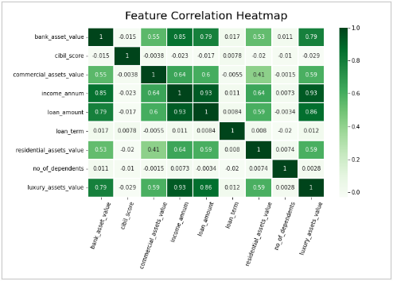

<h1 style="text-align:center;">Loan Approval Project</h1>

<p style="text-align:center;">By Blake Dennett<p>


<h1>Table of Contents</h1>

* <a href="#project-summary">Project Summary</a>

* <a href="#visualizations">Power Bi Visuals</a>

* <a href="#data-analysis">Data Analysis/Preprocessing</a>

* <a href="#machine-learning">Machine Learning</a>

    * <a href="#decision-tree">Decision Tree</a>
    * <a href="#neural-network">Neural Network</a>

* <a href="#acknowledgments">Acknowledgements</a>


## Project Summary
<a href="https://www.kaggle.com/datasets/architsharma01/loan-approval-prediction-dataset">Kaggle Dataset<a>


# Visualizations


## Loan Status Comparisons 


<h4>The credit score has a huge average difference for rejected and approved loans while education, self-employment, and the term of the loan don't seem to be impactful.</h4>

<br><br>

## Benford's Law

<h4>Benford's law deals with the first digit of each number in an exponentially increasing set of values. It states that lower numbers should occur more frequently as seen in the graph below. This law is used for fraud detection.</h4>


### Interpretation


<h4>Here are the actual results of a few of the features from this dataset. In comparison to the example above, it appears that the income column is far from the correct distribution while the others are relatively close.</h4>

<h4>The data, however, only has 4,196 rows and therefore isn't big enough to completly make any final judgement. I'm not positive as the the exact reason that the income is so far off other than the data not being selected completely randomly.</h4>

<br><br>



<h4>Bank, comercial, luxury assets have strong correlation as well as income and loan amount</h4>
<h4>Loan term, cibil score, and number of dependents, however, do not correlate much with any other feature</h4>

<br><br>

## Feature Distributions 


<h4>I'm surprised to see hardly any sure normal distributions. Unfortunately, this may be because the dataset is so small. Additionally, because the annual income is not normally distributed (as it should be) and did not even come close to passing Benford's Law, I wonder how this dataset was selected. One guess I have was that somehow it was chosen based on income. The loan success rate in this data is about 62.22%.</h4>

<br><br>


<h4>Clearly, the bank sets a fairly hard limit with anyone below a 550 credit score, with the occasional exception.</h4>
<h4>In choosing this data, it seems as though it was first filtered due to its clear lack of outliers.</h4><h4>Because the graph is so dense, I used DAX to create a new column to limit the number of points by half.</h4>

```
    filtered_cibil = 
    SWITCH(
        TRUE(),
        MOD(loan_approval_dataset[loan_id], 2) = 0, BLANK(),
        loan_approval_dataset[ cibil_score]
    )
```  

<br><br>

### Assests by Loan Term


<h4>Surprisingly, the luxury assets on average are by far the most expensive, followed by residential.</h4>
<h4>Additionally, it appears that the asset values don't change too much by the loan term.</h4>


<br><br>

### Loan Amount by Income And Collateral


<h4>This graphs compares two features I made which each compare the collateral or income to the loan amount. Surprisingly, as the loans become bigger proportionally to the income, the rejections seems to actually decrease. Additionally, the collateral doesn't seem to have too much impact. The only exception being that any case where the loan is the same or more than the total collateral are all rejected.</h4>

<h4>I did some further analysis on the bottom-left section of this graph as well. The few rejected points in that cluster are surprising because they have both huge collateral and income in proportion to the loan amount. I looked into one and the only poor indicator was the credit score was only 472. Therefore, either the credit score mattered enough to the loan officer to reject this loan or there is missing information that may be intrinsic or something to do with additional debt that the individual may have had.</h4>

<br><br>


# Data Analysis

* <a href="./analysis.ipynb">Analysis Code</a>

## Data Cleaning

<h4>The dataset was very clean. This was unfortunate because I wanted some extra pratice working with more difficult data.</h4>

### Missing Values

<h4>There were no missing values in the data, nor were there any incomplete entries in any of the categorical data.</h4>

### Outliers

<h4>I looked into the numerical features for any values high or lower than three standard deviations from the average. There were 33 total that were above the upper limit and none below the lower. The values were split among the residential and comercial assets. I decided to take the values down to simply equal the upper limit.</h4>

### Negative Values

<h4>There were 28 negative values in the data. All were from the residential assests column and were the exact same value. I thought this was odd and found that most of the instances had different values in the rest of their respective rows. I'm not positve what the cause is, but I just changed them all to zero.</h4>

## Analysis & Feature Engineering

### Total Collateral & Loan Ratio

<h4>I created a new feature that was the sum of all the four assets. I then created a new column that was the ratio of the loan amount to the total collateral. I thought this would be a good indicator of the risk of the loan and will help me with both the machine learning later and further analysis.</h4>

### Loan Amount and Income Ratio

<h4>I made a new column by taking the loan amount and dividing it by the annual income. The average is about 2.88. I thought this would be a valuable new feature because at a glance I could see if the income was too small to be able to support the debt in the future.</h4>

### Credit Score Odd Values

<h4>Looking at the credit score scatter plot found above, I decided to look into the few values that were above a 550 credit score but were still rejected. There were only 13 in total. The primary finding I found was that the collateral was low. The total collateral to loan ratio average for the 13 was 1.08 (meaning the collateral was the same or more than the loan) while the average ratio for the entire dataset was 0.489 (the collateral being about double the loan).</h4>

<h4>Additionally, I took a look at the proportion of the loan to the income. The mean for the entire dataset is 2.88 (the loan being almost three times the annual income). On the other hand, the mean for the 13 rejected loans was 3.66. This seems to be another strong indicator of whether a loan is approved or rejected because a rule of thumb is that the annual income should be roughly a third of the loan.</h4>

### Approvals Below a 550 Credit Score

<h4>Again, looking at the Cibil Score scatter plot found above in the visualizations section, I found a few anomalies. There is a clear cut off at the 550 mark, but I wanted to dive into the approved loans that did fall short. Overall, only 10.36% of the rows in the data that were below a 550 Credit Score were approved for the loan that was asked. I made a hypothesis by assuming that the rest of the major indicators of the records were much better than the average. My hypothesis was wrong. The average income of these points is lower than the total average while the loan amount is higher.Additionally, both the loan collateral ratio and the loan income ratio are worse in these instances. I am surprised that these specific cases were approved over others. The loan term is about 28% of the total average. This could be a reason that the banks approved these loans because the principal could be returned sooner. However, a lower term also means a higher payment.</h4>

<h4>My conclusion equates to two items. The first was found through looking at the specific types of collateral. Specifically comparing the loans under 550 that were and were not approved, the loans that were successful had significantly more collateral in the residential and comercial assets than the luxury and bank assets. This gave a crucial insight because the banks must see these two types as a higher priority. The second conclusion I have is that there is missing data that is not accounted for like time with the bank, age, purpose of the loan, and any sort of date.</h4>

### Approved Vs Rejected

|                     |Approved  |Rejected  |Difference|
|---------------------|----------|----------|----------|
|Credit Score         |711       |429       |282       |
|Income               |5,000,000 |5,100,000 |-100,000  |
|Loan Amount          |14,600,000|14,500,000|100,000   |
|Total Colateral      |31,000,000|31,900,000|-900,000  |
|Loan Collateral Ratio|0.473     |0.457     |0.016     |
|Income to Loan Ratio |3.05      |2.88      |0.175     |
|Dependents           |2.5       |3         |-0.5      |

<h4>This table is the median of each respective row and column, which is why the values are so exact. (The length of the dataset is an odd number, therefore giving a middle number)</h4>

### Interpretation

<h4>In reality, the biggest finding here is that the credit score seems to be a huge indicator for whether a loan is approved or not. The rest of these values are hardly different and therefore do not seem to have much impact. My assumption is that the Cibil score is the first value evaluated and then further analysis is done from there.</h4>

### Correlation and P-Values

<h4>Because the Cibil score seems to be such a primary tool to determine whether a loan is approved, I decided to compare every other numerical feature to it. I used a method called pearsonr from the scipy.stats package. This gave me the correlation and p-value between each feature and the Cibil score. Ultimately, there was very little correlation and each p-value was well above 0.05.</h4>

no_of_dependents
Pearson correlation coefficient: -0.009998469677432271
p-value: 0.5136912487840075

income_annum
Pearson correlation coefficient: -0.02303442169986018
p-value: 0.1323826070379217

loan_amount
Pearson correlation coefficient: -0.017034787023534382
p-value: 0.2658086684763575

loan_term
Pearson correlation coefficient: 0.007809878429870913
p-value: 0.609955527226155

residential_assets_value
Pearson correlation coefficient: -0.02414121331360626
p-value: 0.11477332645819846

commercial_assets_value
Pearson correlation coefficient: 0.002559122155018209
p-value: 0.8672455979184643

luxury_assets_value
Pearson correlation coefficient: -0.028617627946119942
p-value: 0.06153354602205643

bank_asset_value
Pearson correlation coefficient: -0.01547827134015627
p-value: 0.31197944849413606

total_collateral
Pearson correlation coefficient: -0.0236007645692033
p-value: 0.12312703643389432

loan_coll_ratio
Pearson correlation coefficient: 0.0013049879654443949
p-value: 0.9320707271067727

loan_income_ratio
Pearson correlation coefficient: 0.0029798244562687093
p-value: 0.8456763917500009


# Machine Learning

## Decision Tree

## Neural Network


## Acknowledgments